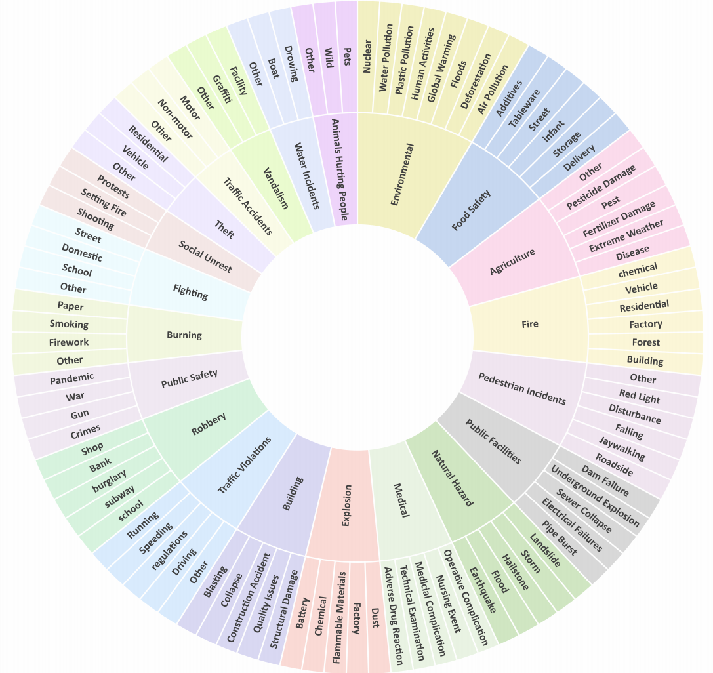
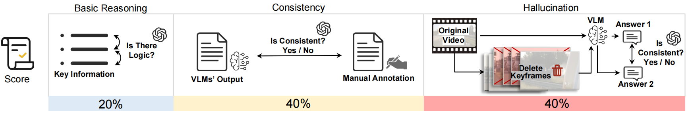

# ECVA

## Overview

We develop **ECVA**, a new benchmark for causation understanding of video anomaly.ECVA is the first large-scale benchmark focused on the causation of video anomalies. Compared with existing datasets, our dataset is more comprehensive and more challenging with much higher-quality annotation.

### Key Features:
- **Multi-Modal Processing**: balabalabalabalabalabalabalabalabala
- **Flexible Model Design**: balabalabalabalabalabalabalabalabala
- **Complete Pipeline**: balabalabalabalabalabalabalabalabala

---

## Table of Contents
- [Installation](#installation)
- [Benchmark and Evaluation Metric](#Benchmark)
- [Train Dataset Preparation](#dataset-preparation)
- [Model Training](#model-training)
- [Inference](#inference)
- [Acknowledgement](#Acknowledgement)
- [License](#license)

---

## Installation

To install and set up the environment, follow these steps:

```bash
git clone git@github.com:Dulpy/ECVA.git
cd multimodal-video-large-model
pip install -r requirements.txt
```

## Benchmark and Evaluation Metric
- We develop **ECVA**, a new benchmark for causation understanding of video anomaly.ECVA is the first large-scale benchmark focused on the causation of video anomalies. Compared with existing datasets, our dataset is more comprehensive and more challenging with much higher-quality annotation.

- Our ECVA dataset contains 2240 video clips and 6720 question-answer pairs, the total length of these videos is 88.16 hours, and the average frames of videos is 8460. The frames are extracted from the original videos at a rate of 60 FPS.The videos encompass a wide range of domain

- You can download the original video data from this link: [Download Original Video Data](your_link_address)



### The proposed evalution mertic
We proposed a new mertic to ......

- Basic Reasoning:....
- Consistency:.....
- Hallucination:.....




### Evaluate your results on ECVA

#### 1. Reformat your results

For each video response, you need to organize it into the following format:
```bash
[{
  "video_file": xxxx
  "prompt": xxxx
  "output": xxxxx
  "task_type": xxxx
  "human_expert_answer": xxxx
},
]
```

#### 2. Evaluate your results

Prepare the model's answers and our benchmark answers, then use the script [here](eval_traditional/) to score them with GPT assistent.Because GPT will be used to assist in the evaluation, you will need to fill in your own key in the [relevant configuration file](AnomEval\evaluating_system_v2\config.py)

### Evaluate your results on traditional mertic

#### 1. Reformat your results as shown above

#### 2. Evaluate your results

Prepare the model's answers and our benchmark answers, then use the script [here](AnomEval\evaluating_system_v2\main_with_breakpoint_check_v824_use_this.py) to evaluate them use **[BLUE](https://github.com/neural-dialogue-metrics/BLEU), [ROUGE](https://github.com/pltrdy/rouge), [BLEURT](https://github.com/google-research/bleurt) and [UNIEVAL](https://github.com/maszhongming/UniEval)**.

## Training Dataset Preparation

We introduce a novel video large language model named **Anomaly Shield** (AnomShield), which is designed to address the three challenges presented by ECVA.You can re-organize the annotated video/image sft data according to the following format and place the image/video data in the path **ECVA/datasets/pretraining/** and **ECVA/datasets/videosft/**

```bash
[
    {
        "id": 0,
        "video": "images/xxx.jpg",
        "conversations": [
            {
                "from": "human",
                "value": "<image>\nWhat are the colors of the bus in the image?"
            },
            {
                "from": "gpt",
                "value": "The bus in the image is white and red."
            },
            ...
        ],
    }
    {
        "id": 1,
        "video": "videos/xxx.mp4",
        "conversations": [
            {
                "from": "human",
                "value": "<video>\nWhat are the main activities that take place in the video?"
            },
            {
                "from": "gpt",
                "value": "The main activities that take place in the video are the preparation of camera equipment by a man, a group of men riding a helicopter, and a man sailing a boat through the water."
            },
            ...
        ],
    },
    ...
]
```

## Model Training

### 1. Prepare CLIP and Mistral Weight
    
 - For Vision-Encoder, similar to most multi-modal large models, AnomShield uses the CLIP series as the visual encoder. You can download the related pre-trained weights from [openai/clip-vit-large-patch14](https://huggingface.co/openai/clip-vit-large-patch14).
    
 - For the base model, we utilize the powerful Mistral series to help analyze the video content and provide reliable, accurate answers. You can download the related pre-trained weights from [mistralai/Mistral-7B-Instruct-v0.2](https://huggingface.co/mistralai/Mistral-7B-Instruct-v0.2).


### 2. Pretrain Command
```bash
cd ECVA/scripts/vllava/mamba/
./pretrain.sh
```
### 3. Video SFT Command
```bash
cd ECVA/scripts/vllava/mamba/
./finetune.sh
```

## Inference

Video/Image Inference. We have inherited the inference code from **VideoLLaMA2**.You can refer to the **inference.ipynb** to implement the model inference, and you need to prepare the relevant model weights according to the instructions in the script.

```bash

cd ECVA/
run inference.ipynb in the jupyter environment

```

## Acknowledgement
The codebase of **ECVA** is adapted from [**VideoLLaMA2**](https://github.com/DAMO-NLP-SG/VideoLLaMA2). We are grateful for the foundational work done by the VideoLLaMA2 team, which has significantly contributed to the development of this project.

## License